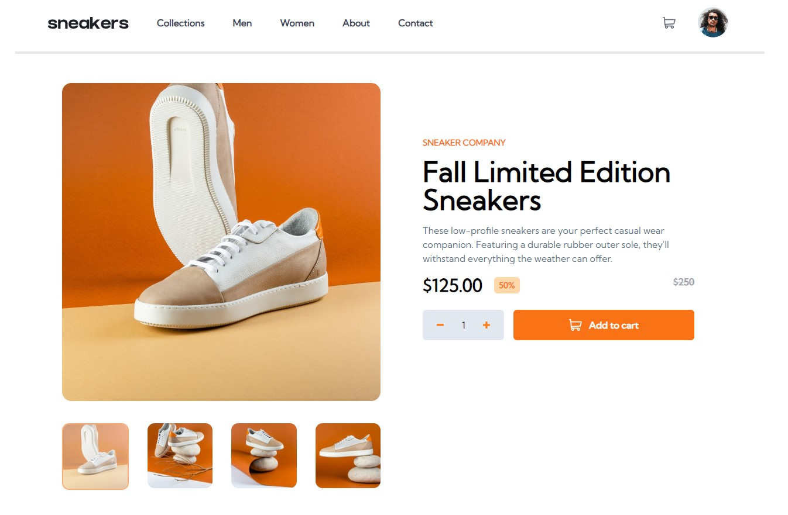

<h3 align="center">Frontend Mentor E-commerce Product Page</h3>

  <p align="center">
    project_description
    <br />
    <a href="https://github.com/Astilion/E-commerce-product-page"><strong>Explore the docs »</strong></a>
    <br />
    <br />
    <a href="https://ecommerce-frontentmentor-astilion.netlify.app/">View Demo</a>
  </p>
</div>

<details>
  <summary>Table of Contents</summary>
  <ol>
    <li>
      <a href="#about-the-project">About The Project</a>
      <ul>
        <li><a href="#built-with">Built With</a></li>
      </ul>
    </li>
    <li>
      <a href="#getting-started">Getting Started</a>
      <ul>
        <li><a href="#prerequisites">Prerequisites</a></li>
        <li><a href="#installation">Installation</a></li>
      </ul>
    </li>
    <li><a href="#usage">Usage</a></li>
    <li><a href="#roadmap">Roadmap</a></li>
    <li><a href="#contact">Contact</a></li>
  </ol>
</details>

## About The Project



This is a project from the Frontend Mentor website. It shows the visual layer of the site and its responsiveness. In addition, functions have been included to add and modify the status of products in the shopping cart and the total price with promotion. I used React, Redux and Framer Motion in it.

<p align="right">(<a href="#readme-top">back to top</a>)</p>

### Built With

[![React.js]][React-url]
[![TailwindCss]][Tailwind-url]
[![Javascript]][Javascript-url]
[![Typescript]][Typescript-url]
[![HTML5]][HTML5-url]
[![CSS]][CSS-url]
[![Redux]][Redux-url]
Framer Motion

<p align="right">(<a href="#readme-top">back to top</a>)</p>

## Getting Started

To get a local copy up and running follow these simple example steps.

### Prerequisites

This is an example of how to list things you need to use the software and how to install them.

- npm
  ```sh
  npm install npm@latest -g
  ```

### Installation

1. Clone the repo
   ```sh
   git clone https://github.com/Astilion/E-commerce-product-page.git
   ```
2. Install NPM packages
   ```sh
   npm install
   ```

<p align="right">(<a href="#readme-top">back to top</a>)</p>

## Usage

You can add products to the cart in different quantities, modify the status of the cart by adding or removing products.
You have access to an interactive carousel in two variants (mobile and desktop).

<p align="right">(<a href="#readme-top">back to top</a>)</p>

## Roadmap

- [x] Structure & styling
- [x] Adding, removing & modyfying cart
- [ ] Signup & Login
- [ ] Connect to database
- [ ] Adding more product
- [x] Live Demo

<p align="right">(<a href="#readme-top">back to top</a>)</p>

## Project Status

Project is: _in-progress_

<!-- CONTACT -->

## Contact

Mateusz Kamiński - mkaminski.contact@gmail.com

Project Link: [https://github.com/Astilion/E-commerce-product-page](https://github.com/Astilion/E-commerce-product-page)

<p align="right">(<a href="#readme-top">back to top</a>)</p>

[React.js]: https://img.shields.io/badge/React-20232A?style=for-the-badge&logo=react&logoColor=61DAFB
[React-url]: https://reactjs.org/
[TailwindCss]: https://img.shields.io/badge/Tailwind_CSS-38B2AC?style=for-the-badge&logo=tailwind-css&logoColor=white
[Tailwind-url]: https://tailwindcss.com/
[Typescript]: https://img.shields.io/badge/TypeScript-007ACC?style=for-the-badge&logo=typescript&logoColor=white
[Typescript-url]: typescriptlang.org/
[Javascript]: https://img.shields.io/badge/JavaScript-F7DF1E?style=for-the-badge&logo=javascript&logoColor=black
[Javascript-url]: https://www.javascript.com/
[HTML5]: https://img.shields.io/badge/HTML5-E34F26?style=for-the-badge&logo=html5&logoColor=white
[HTML5-url]: https://developer.mozilla.org/en-US/docs/Web/HTML
[CSS]: https://img.shields.io/badge/CSS3-1572B6?style=for-the-badge&logo=css3&logoColor=white
[CSS-url]: https://developer.mozilla.org/en-US/docs/Web/CSS
[Redux]: https://img.shields.io/badge/Redux-593D88?style=for-the-badge&logo=redux&logoColor=white
[Redux-url]: https://redux.js.org/
